# Castle Quake

A port of **Quake 1** to the [Castle Game Engine](https://castle-engine.io/) (Object Pascal / Free Pascal). It plays the original **Quake 1 Demo / Shareware** data and the bundled open-source **LibreQuake** assets, on Windows, Linux and in the browser.

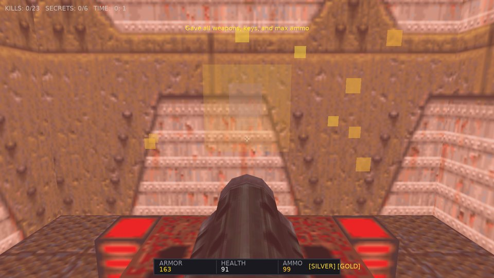

- 🌐 **[Play in the browser (WebAssembly)](https://mariuz.github.io/castle-quake1/)**
- 📦 **[Windows, Linux and macOS releases](https://github.com/mariuz/castle-quake1/releases)**
- 📖 **[Architecture and engine mapping](docs/ARCHITECTURE.md)**
- 🗺️ **[Quake 1 comparison and roadmap](docs/ROADMAP.md)**

Everything is parsed from the PAK archives at run time: BSP levels become X3D scene graphs, Alias models become animated meshes, textures and sounds are served to the engine through custom URL protocols. The gameplay is a port of the original rules (player physics, all weapons, all monsters, level flow), and the real `progs.dat` can run the game instead ("QuakeC mode", for mods). Inspired by [mariuz/castle-doom](https://github.com/mariuz/castle-doom).

---

## Screenshots

| | |
| :---: | :---: |
| 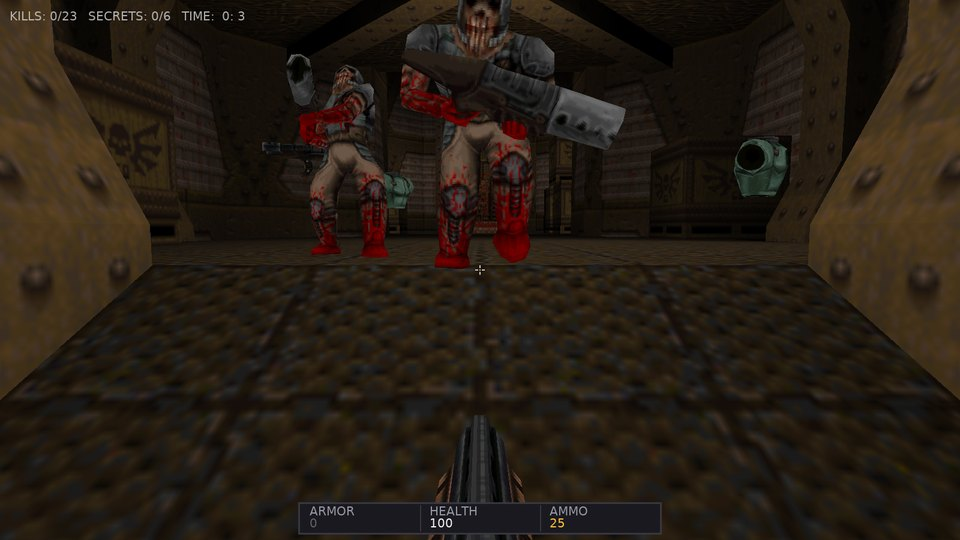 | 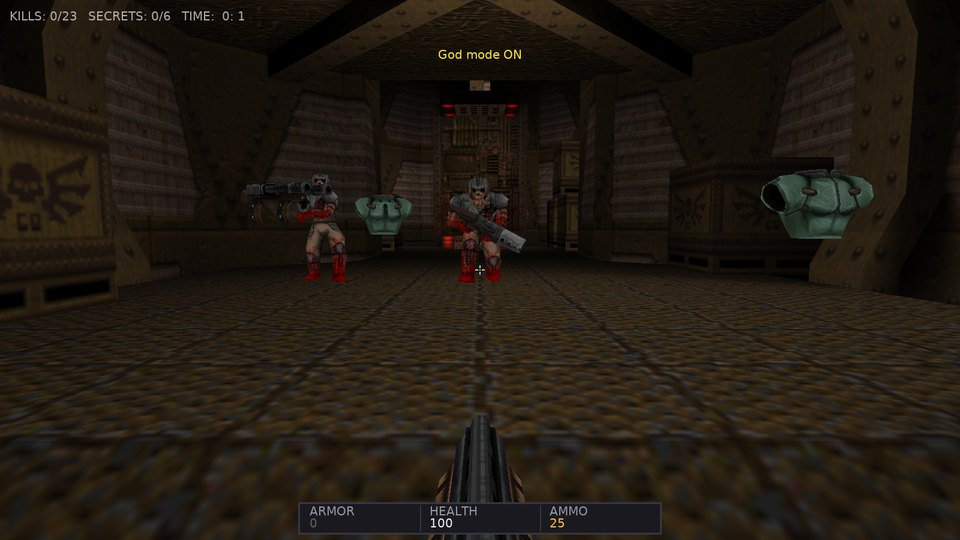 |
| Monsters with Quake's AI: sight, chase, attacks, pain and gibs | Infighting and sound propagation wake the rest |
| 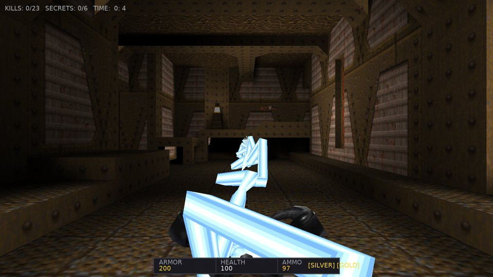 | 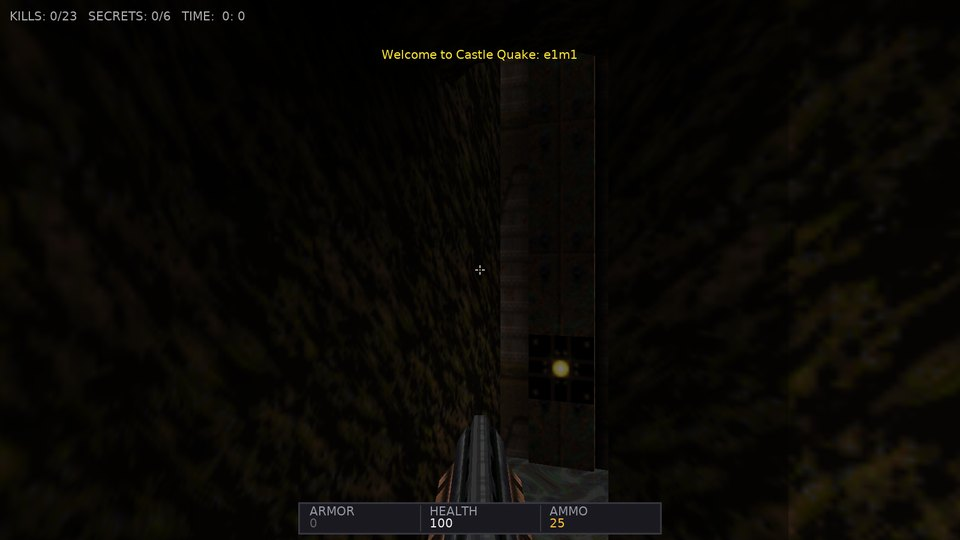 |
| All eight weapons, here the lightning gun beam | Water, slime and lava ripple like `R_Turbulent` |
| 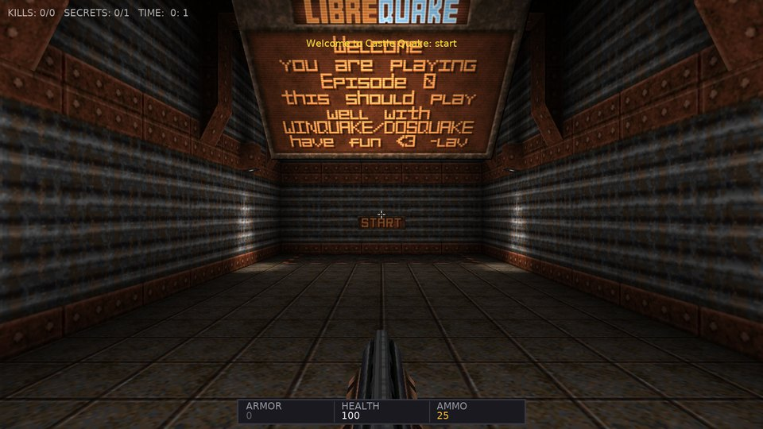 | 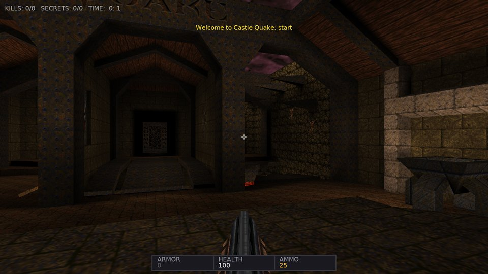 |
| The LibreQuake episode hub (bundled) | The original `start.bsp` hub with `-game quake` |
| 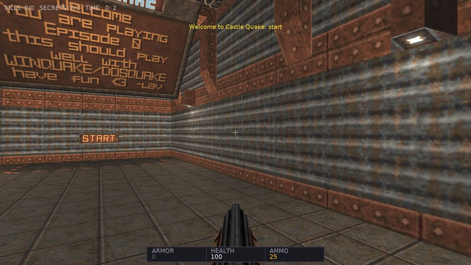 | 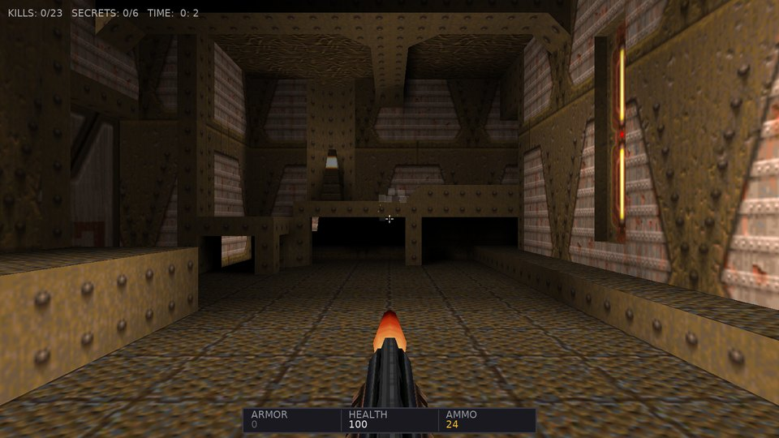 |
| "Dynamic PBR" world lighting with shadow maps, instead of the lightmaps | QuakeC mode: `progs.dat` runs the level |
| 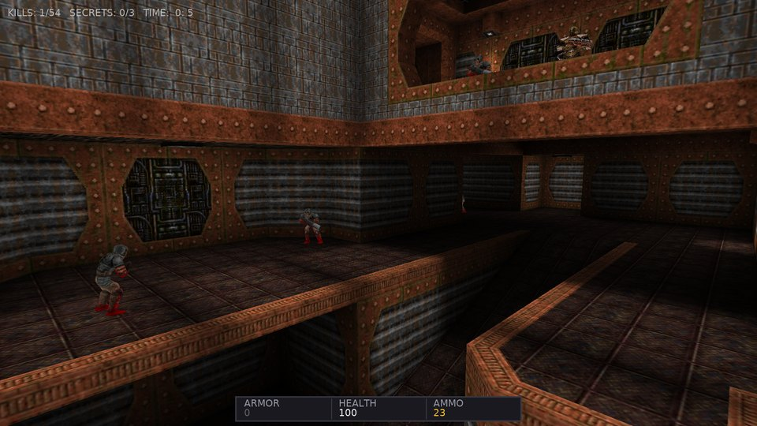 | 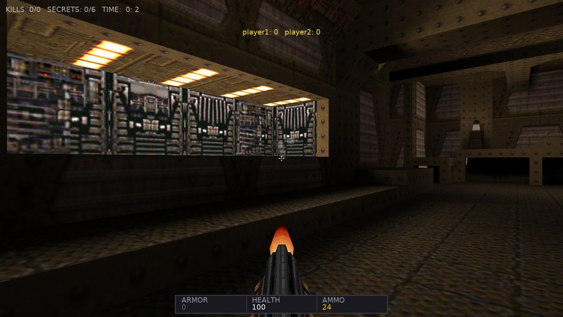 |
| The PAK demos play back (protocol 15) | Deathmatch over UDP with the scoreboard |

---

## Features

**World**
- BSP v29 levels from `.pak` files turned into X3D scene graphs, with triangle collision and the Quake clipping hulls for movement.
- The scrolling two layer sky or a six face skybox (`sky` worldspawn key with `gfx/env/*.tga`), fullbright texture pixels, translucent liquids seen from both sides, lava splashes.
- Two world lighting modes: Quake's own lightmaps, all lightstyle layers blended in a GLSL effect with the live lightstyle values and dynamic lights (muzzle flashes, explosions), or dynamic PBR lighting by the map's light entities with real-time shadow maps.
- Dual-layer scrolling sky, turbulent liquid surfaces, animated textures, particles (gunshots, blood, explosions, trails, teleports), underwater warp and palette tints.
- Only the potentially visible set is drawn: the world is split by BSP subtrees and the parts outside the camera leaf's PVS are hidden (seen through translucent water too); console `novis 1` draws everything.
- Interactive brush entities: doors (including silver and gold key doors), platforms, buttons, trains, secret doors, triggers, teleporters, level changes.

**Gameplay**
- A port of the NetQuake player physics: friction and acceleration, air control, stair stepping, swimming, water jumps, bunny hopping.
- All eight weapons from `weapons.qc`: hitscan, nails, bouncing grenades, rockets with splash damage, the lightning beam.
- All thirteen monsters and both bosses with QuakeC data: sight checks, `SV_movestep` chasing, attacks on animation frames, pain, death, gibbing, infighting, sound propagation.
- Level flow: the hub with skill and episode portals, runes and episode gates, keys, secrets, level parms, intermission with counting tallies, the episode texts, the all-four-runes text and the Shub-Niggurath ending with the end-of-game text.
- Save and load (F6 / F9, console `save` / `load`), including projectiles and gibs in flight.
- Demos: `.dem` playback with server frame interpolation, and recording of your own games.

**QuakeC mode**
- `progs.dat` runs the level: a QuakeC VM (`pr_exec.c` semantics, all builtins) with a world host for traces, movetypes and the player physics. Mods loaded with `-pak` run unchanged. Savegames and demo recording work here too.

**Multiplayer**
- Deathmatch and coop over UDP: the host runs the QuakeC rules, NetQuake protocol 15 messages stream the game to every player, the client is the demo player with input. Host from the menu or with `-host`, join with `-connect`.
- Browser players: a host started with `-websocket 26001` (or a separate `-wsrelay host:port`) relays WebSocket connections to the game, and the web build joins with `?connect=host` in its URL (an https page needs `wss://`, so a TLS proxy in front of the relay).
- Client-side prediction of your own movement (the server runs exactly the inputs you sent, the client replays the unacknowledged ones) and UDP hole punching through a rendezvous service: `-rendezvous` on a reachable machine, `-host e1m1 -register myname@rendezvous`, `-connect myname@rendezvous`.

**Engine integration**
- Custom URL protocols `quakepak:` and `quaketex:` feed the engine's loaders straight from the archives.
- Spatial audio with OpenAL, music per map from the CD track number (`svc_cdtrack` in demos and multiplayer), muffled under water with an EFX low-pass filter (Web Audio in the browser), static ambient emitters and leaf ambients, OGG music.
- Every component is named for the engine's inspector (F8): `func_door_7`, `monster_ogre_3`, `light_12`...
- Developer console (`~`): `map <name>`, `god`, `give all`, `shadows <0|1>`, `save`, `load`, `debug <all|off|triggers|monsters|movers|leaf>` (wireframe overlay of triggers, monsters and sight lines, movers and the player's BSP leaf), `wateralpha <0..1>`, `fps`, `novis <0|1>`, `help`.
- A headless test harness (`--autotest`, `--demo`) drives the game by script and takes screenshots; the images above come from it.

---

## Controls

| Key | Action |
| --- | --- |
| **W, A, S, D** / Arrows | Move forward, strafe left / right, backward |
| **Mouse** | Look around |
| **Left Mouse / Ctrl** | Fire |
| **Space** | Jump / swim up |
| **Shift** | Walk (running is the default) |
| **E** | Use: doors, buttons |
| **1 .. 8** | Weapons: Axe, Shotgun, Super Shotgun, Nailgun, Super Nailgun, Grenade Launcher, Rocket Launcher, Lightning Gun |
| **F1 / C** | Camera: first person, third person, free fly |
| **F2** | Dynamic shadows on / off |
| **F6 / F9** | Quicksave / quickload |
| **F8** | Engine inspector (component tree, live properties) |
| **F12** | Screenshot |
| **~** | Developer console |
| **Gamepad** | Left stick moves, right stick turns, A jumps, X uses, RB / right trigger fires, D-pad changes weapons; sensitivity, dead zone and inverted look in Options > Controls |

Every key can be rebound in Options > Controls (saved in the user config).
| **Escape** | Menu |

---

## Building and Running

Prerequisites: [Castle Game Engine](https://castle-engine.io/) 7.0-alpha.3 or later (the snapshot bundles FPC 3.2.2).

### Windows (PowerShell)
```powershell
$env:PATH = "C:\castle-engine\bin;C:\castle-engine\tools\contrib\fpc\bin;" + $env:PATH
castle-engine compile --mode=release
.\castle-quake1.exe
```
Audio needs `OpenAL32.dll` and `wrap_oal.dll` next to the executable (included in the releases).

### Linux
```sh
export CASTLE_ENGINE_PATH=/path/to/castle-engine
$CASTLE_ENGINE_PATH/tools/build-tool/castle-engine compile --mode=release
./castle-quake1
```

### macOS
The releases include app bundles for Intel and Apple Silicon Macs. They are not signed or notarized: on the first start use right-click > Open, or `xattr -dr com.apple.quarantine "Castle Quake.app"`. Building locally is the same `castle-engine compile` with the engine set up for macOS.

### Web
The `test` job builds `tests/quaketests` (the BSP tracer, the QuakeC VM, savegames, the demo writer and reader against the shareware pak) and runs it before the packages are released; locally: `cd tests && castle-engine compile && ./quaketests ../data/paks`.

The `Web` workflow builds the WebAssembly version with FPC's wasm32 cross compiler and Pas2js and deploys it to GitHub Pages: [mariuz.github.io/castle-quake1](https://mariuz.github.io/castle-quake1/).

### Command line
```
castle-quake1 -warp e1m1                      Jump to E1M1
castle-quake1 -warp start                     The LibreQuake hub
castle-quake1 -game quake -warp start         The original Quake hub with the episode portals
castle-quake1 -pak custom.pak                 Load another PAK (mods, the registered id1 paks)
castle-quake1 -playdemo demo1.dem             Play a demo from the PAKs
castle-quake1 -qc e1m1                        QuakeC mode: progs.dat runs the game
castle-quake1 -game hipnotic -qc start        A mission pack or mod (its pak*.pak directory next to the executable) with its QuakeC
castle-quake1 -host start                     Host a deathmatch game on UDP port 26000 and play in it
castle-quake1 -host e1m1 -coop -skill 2       Host a cooperative game
castle-quake1 -connect 192.168.1.10           Join a game (host[:port])
castle-quake1 -host start -websocket 26001    Host and accept players from the web build (.../play/?connect=yourhost)
castle-quake1 -wsrelay 192.168.1.10:26000     Only a WebSocket relay for a game hosted elsewhere
castle-quake1 --export-map e1m1 e1m1.x3d           Export a level as X3D (or .gltf) for the editor / view3dscene
castle-quake1 --autotest e1m1 shot --demo "W:1,S,X,W:0.5,S,Q"   Headless test with screenshots
```
The Options menu switches the world lighting between Quake's lightmaps and dynamic PBR lighting.

### Headless testing
`--autotest <map|qc:map|host:map|connect:host|name.dem> <prefix> --demo "<actions>"` loads a level without any input, runs the comma separated actions and exits. Actions: `W:sec` wait, `S` screenshot, `X` fire, `F:sec` hold fire, `U` use, `C:slot` weapon, `A:deg` / `T:deg` / `P:deg` yaw, turn, pitch, `M:units` / `G:x;y;z` teleport, `V:f;s;u` move, `J` jump, `K` / `Y` cheats, `O:slot` / `L:slot` save and load, `R:name` / `R` record a demo, `B:1` / `B:0` world lighting, `I` log the scene tree, `Q` quit. See [CLAUDE.md](CLAUDE.md) for the details.

---

## Continuous Integration

- `.github/workflows/build.yml`: Windows x86_64, Linux x86_64 and macOS x86_64 / aarch64 (app bundle zips) packages on GitHub's runners (FPC and the CGE snapshot set up by `castle-build-ci`). A tag `v*`, or a manual run with a `release_tag`, creates the GitHub Release with the packages.
- `.github/workflows/web.yml`: the WebAssembly build and the GitHub Pages deployment.

---

## License

- Code: MIT License (matching Castle Game Engine and mariuz/castle-doom).
- LibreQuake assets: see `data/paks/COPYING.txt` and `CREDITS.txt` (GPL / BSD / CC).
- Quake is a registered trademark of id Software / ZeniMax Media.
